

# Changelog for QGIS 2.4 {#changelog24}

Release date: 2014-06-27

Change log for the next release of QGIS 2.4.0. The emphasis on this release has been very much on polish and performance - we have added many new features, tweaks and enhancements to make the user interface more consistent and professional looking (and hopefully easier to use). The composer (used for creating print ready maps) has had a lot of work done to it to make it a more viable platform for creating great cartographic outputs.

Whenever new features are added to software they introduce the possibility of new bugs - if you encounter any problems with this release, please file a ticket [on the QGIS Bug Tracker](http://hub.qgis.org).

We would like to thank the developers, documenters, testers and all the many folks out there who volunteer their time and effort (or fund people to do so).

From the QGIS community we hope you enjoy this release! If you wish to donate time, money or otherwise get involved in making QGIS more awesome, please wander along to [qgis.org](https://qgis.org) and lend a hand!

Finally we would like to thank our official sponsors for the invaluable financial support they provide to this project:

-   GOLD Sponsor: [Asia Air Survey, Japan](http://www.asiaairsurvey.com/)
-   SILVER Sponsor: [G.A.I.A. mbH, Germany](http://www.gaia-mbh.de/)
-   SILVER Sponsor: [State of Vorarlberg, Austria](http://www.vorarlberg.at/)
-   BRONZE Sponsor: [www.molitec.it, Italy](http://www.molitec.it/)
-   BRONZE Sponsor: [www.argusoft.de, Germany](http://www.argusoft.de)
-   BRONZE Sponsor: [www.openrunner.com, France](http://www.openrunner.com)
-   BRONZE Sponsor: [www.eschenlaub.de, Germany](http://www.eschenlaub.de)

A current list of donors who have made financial contributions large and small to the project can be seen on our [donors list](https://qgis.org/en/site/about/sponsorship.html#list-of-donors).

If you would like to make a donation or sponsor our project, please visit [our sponsorship page](https://qgis.org/en/site/about/sponsorship.html#sponsorship) for details. QGIS is Free software and you are under no obligation to do so. Sponsoring QGIS helps us to fund our six monthly developer meetings, maintain project infrastructure and fund bug fixing efforts.

::: {.contents local=""}
:::

## General

### Feature: Generate band name with NetCDF EXTRA_DIM

The NetCDF provided extra dimensional information. This information provides metadata on each band. These metadata can be used to explain the name of each band. For example, the bands of a NetCDF file represents the temperature at a given depth. For the user, it is easier to select a band with depth information, rather than only the band number.

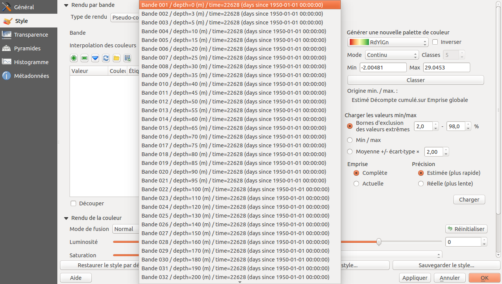

### Feature: Applying scale and offset to raster data

In some raster datasources, data are stored as interger with a scale and an offset in the metadata. The scale and offset can be used to get the right data. QGIS applies its to raster data to provider to users right information for legend, histogram and identify.

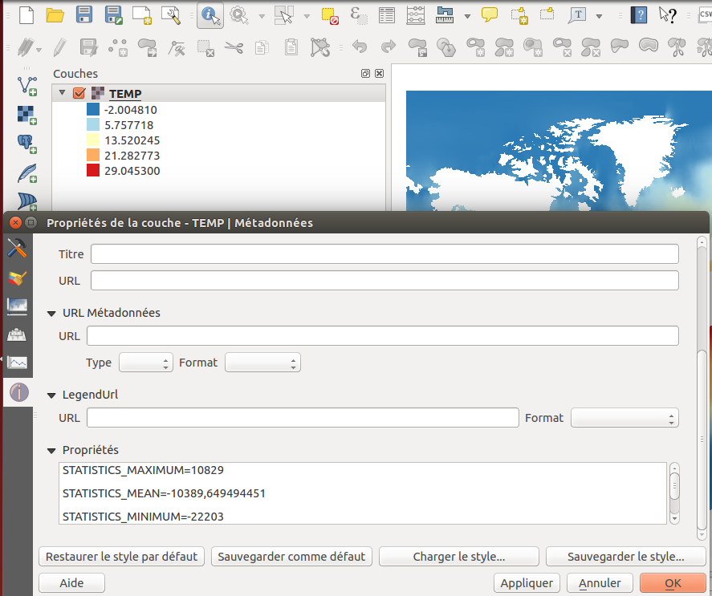

### Feature: Quick field field calc bar in attribute table

We have a great new feature for those working with calculated fields in vector attribute tables. The new quick calculation bar lets you update the values in a column in the attribute table quickly and easily.

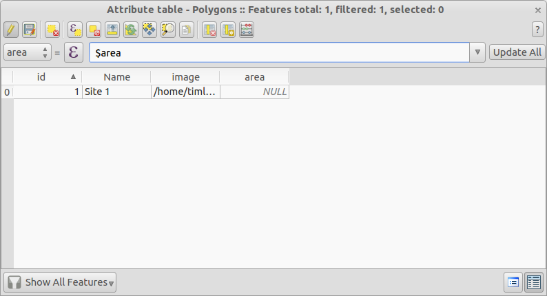

### Feature: Colour preview modes in composer and map canvas

A really innovative feature that has been added to 2.4 is support for grayscale and colour blindness previews. This allows you to visualise how people with colour blindness will perceive your cartography and map layout, or how your map will look if it\'s printed in grayscale. You can read more about this new feature [here](http://nyalldawson.net/2014/05/colour-blindness-and-grayscale-previews-in-qgis-2-4/).

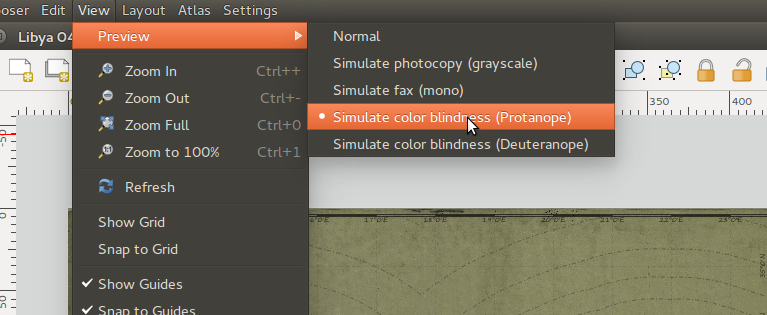

### Feature: QLR QGIS Layer files

Added support for QGIS Layer Definition files or simply QLR (see <http://nathanw.net/2014/03/12/qgis-qlr/>). QLR file is a file that points to the data, contains all the styling, and other information. You can then just add this file and it will do all the other magic for you. QLR makes it easy to add same layer to multiple map documents, inheriting all of the properties which have been set and works with any layer supported in QGIS, expect special plugin layers.

### Feature: New expression functions

We have some new functions available in the expression builder.

-   bounding box (bounds)
-   bounding box width & height (bounds_width/bounds_height)
-   min/max x/y coordinates (xmin/xmax/ymin/ymax)
-   new wordwrap function that returns a string wrapped to a maximum/minimum number of characters

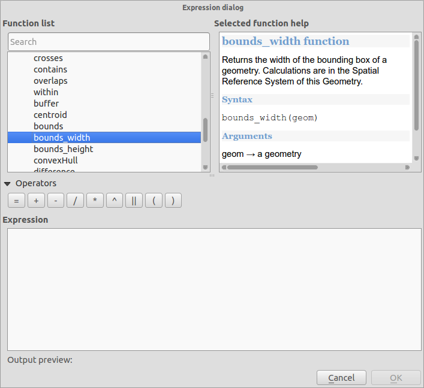

### Feature: Copy, paste and drag and drop colours

You can now copy, paste, drag and drop colours between any colour input widget in QGIS. See this [article](http://nyalldawson.net/2014/05/colour-shortcuts-in-qgis-2-4/) for more information on how this new feature works. Hex color codes and rgb strings can also be pasted on to colour buttons to allow importing colours from outside of QGIS.

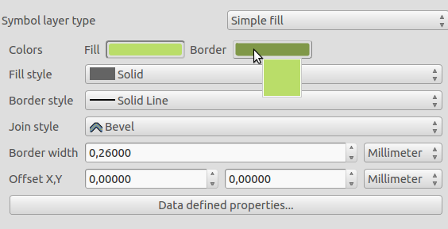

### Feature: Multi-threaded rendering

This is one feature we simply cannot do justice to with a screenshot -QGIS now supports multi-threaded rendering! What this means is that when drawing the map, QGIS will split the drawing work between all of the cores in your CPU, making the process more efficient and responsive. By **responsive** we mean that you no longer need to wait for the map view to update before you can pan or zoom again. Also the map display updates incrementally allowing you to see if the map is positioned correctly early on in the drawing process. Take a look at [this article](http://www.lutraconsulting.co.uk/casestudies/qgis-multi-threaded-rendering) for a more detailed overview of the multi-threaded rendering system. You will find some options in the QGIS settings dialog that allow you to manage the behaviour of multi-threaded rendering.

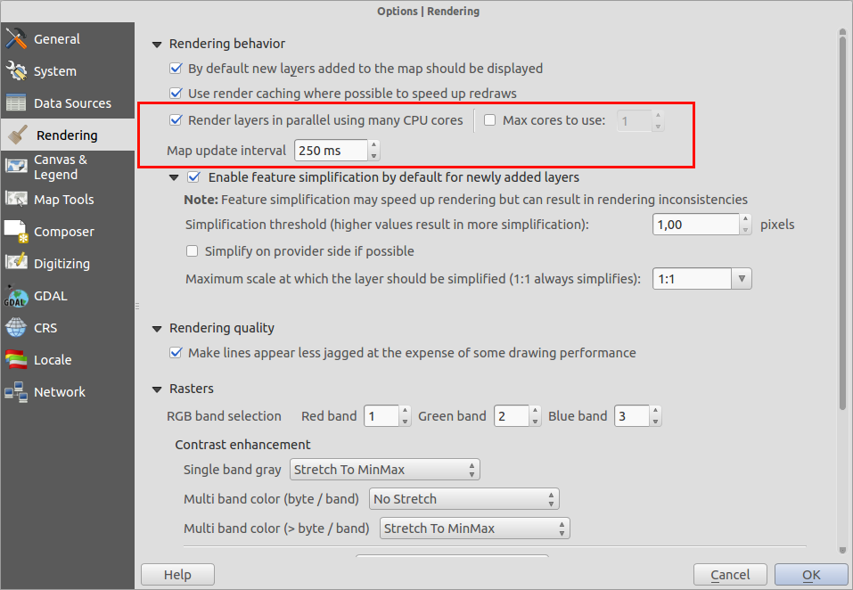

## Labelling

### Feature: Label features multiple times

Long lines (such as contour lines or roads) can now be repeatedly labeled at regular intervals. One can choose between mm and map units for specifying the repetition interval. At the time of the release there is still an issue with \"merge connected lines to avoid duplicate\" setting.

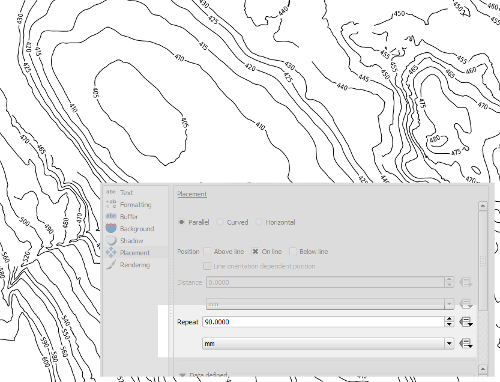

## Map Composer

### Feature: Improvements to composer picture items

The image item in composer is now \'atlas friendly\' - you can use an **expression to define which image** should be shown for each atlas page. You can also now set the **resize mode** (zoom, clip, stretch etc.) for the image in relation to its frame size and dimensions. You can also specify the placement of the image relative to its frame using the new **placement** item property.

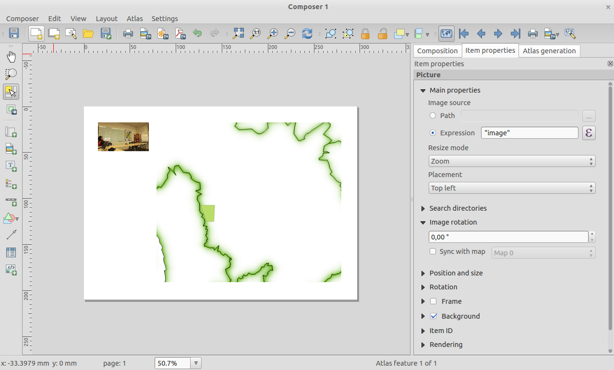

### Feature: Predefined scales mode for atlas maps

When working with atlas map items, you can now specify a predefined scale mode for the map. It will use the best fitting option from the list of predefined scales in you your project properties settings (see Project -\> Project Properties -\> General -\> Project Scales to configure these predefined scales).

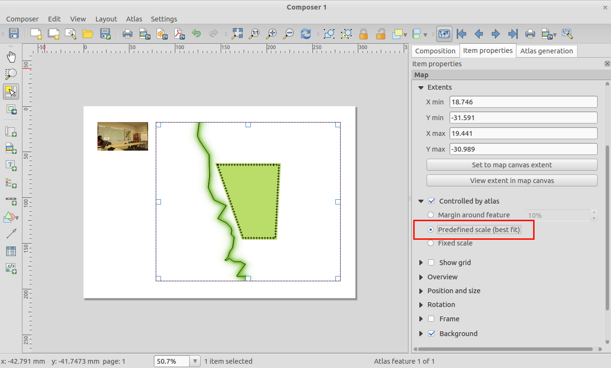

### Feature: Improved attribute tables in composer

We have made a number of improvements to the ability to display tables in your composer layouts:

-   Support has been added for reordering columns within a table
-   Added support for expression based columns
-   You can now set the alignment of individual table columns, and also specify the alignment for the table\'s header cells
-   Table contents can be filtered by an expression

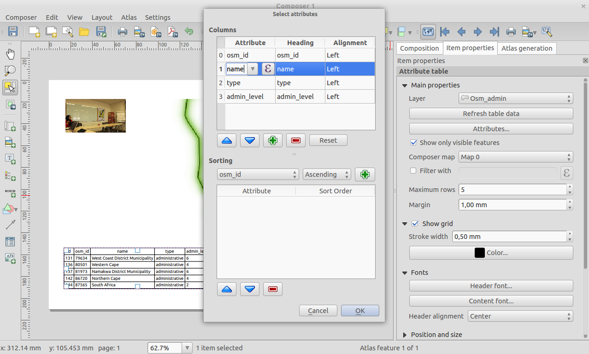

### Feature: General composer improvements

There are a number of additions to the map composer to make life easier while working in map composition mode:

-   Added button to view current map item extent in main map canvas
-   Ability to export SVG images from composer with layers
-   Set line join and cap style for scalebars
-   Support for setting the line join style for item frames

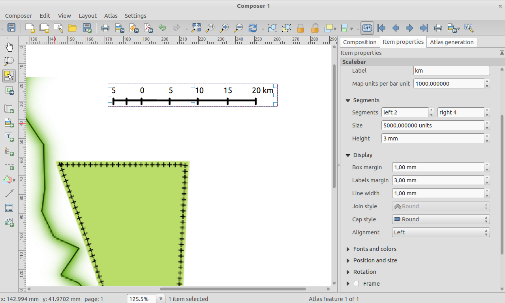

### Feature: Improvements to HTML frames

HTML Frames in the composer have been improved. There is a new **add frame** button which can be used to manually create multiple linked frames. We have also improved our page break logic making it less likely that you will get page breaks that cut through the middle of lines of text when paginating HTML frames.

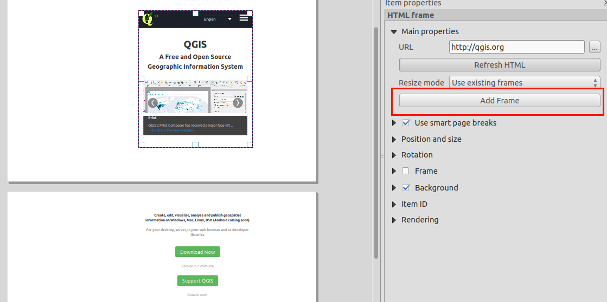

## Plugins

### Feature: MetaSearch Catalogue Client Plugin

MetaSearch is a QGIS plugin to interact with metadata catalogue services, supporting the OGC Catalogue Service for the Web (CSW) standard. This plugin provides an easy and intuitive approach and user-friendly interface to searching metadata catalogues within QGIS and now ships by default with the QGIS core product.

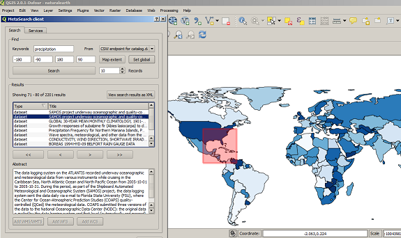

## Symbology

### Feature: Shapeburst fill style

We have a great new render in QGIS 2.4. The shapeburst renderer will allow you to fill polygons with a gradient extending from the line edge towards the polygon interior. You can read more about **shapeburst** [here](http://nyalldawson.net/2014/06/shapeburst-fill-styles-in-qgis-2-4/?utm_source=rss&utm_medium=rss&utm_campaign=shapeburst-fill-styles-in-qgis-2-4).

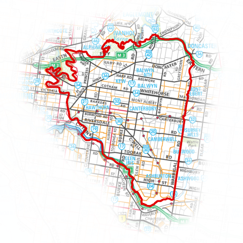

### Feature: Option to shift marker line placement

When using a marker line along a line or polygon edge, you can now specify an **offset** so that the marker line starts a set distance from the beginning of the line. If a marker line is set to \"first vertex\" or \"last vertex\" mode, than this offset will control how far along the line from the vertex the marker is placed.

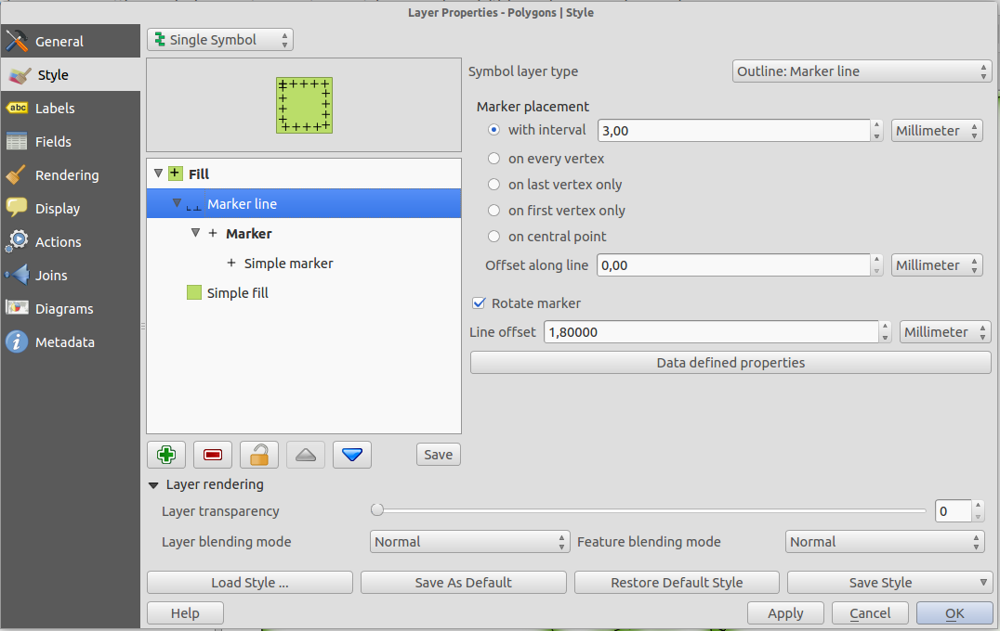

### Feature: New Inverted Polygon renderer

A new renderer has been added for polygon features, allowing you to style everything **outside** your polygons. This can be useful for highlighting areas, or for creating cartographic masks. When used with new shapeburst style, you can now produce output as shown in the image for this entry.

**Note:** The new version of plugin mask helps to easily create mask layers from the current selection, label features only in those areas, and generate an automatic mask in Atlas map generation.

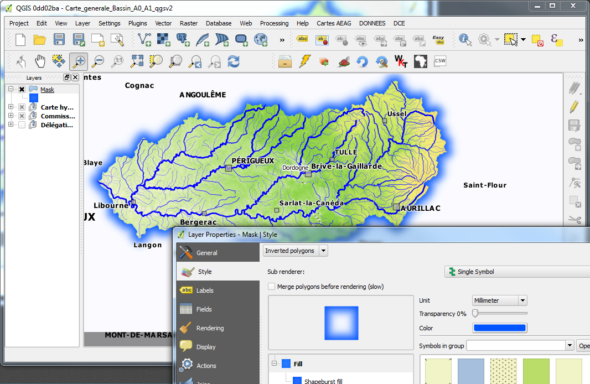

### Feature: Saving and recovering styles with Spatialite layers

In the previous version was possible to save style with postgres layers, now will be possible for Spatialite layers too. This functions allow to embed different styles inside a spatialite container simplifying sharing data and their presentation. A video tutorial of this funcionality can be found here <http://pvanb.wordpress.com/2014/05/15/saving-layer-styles-to-your-spatialite-database/>

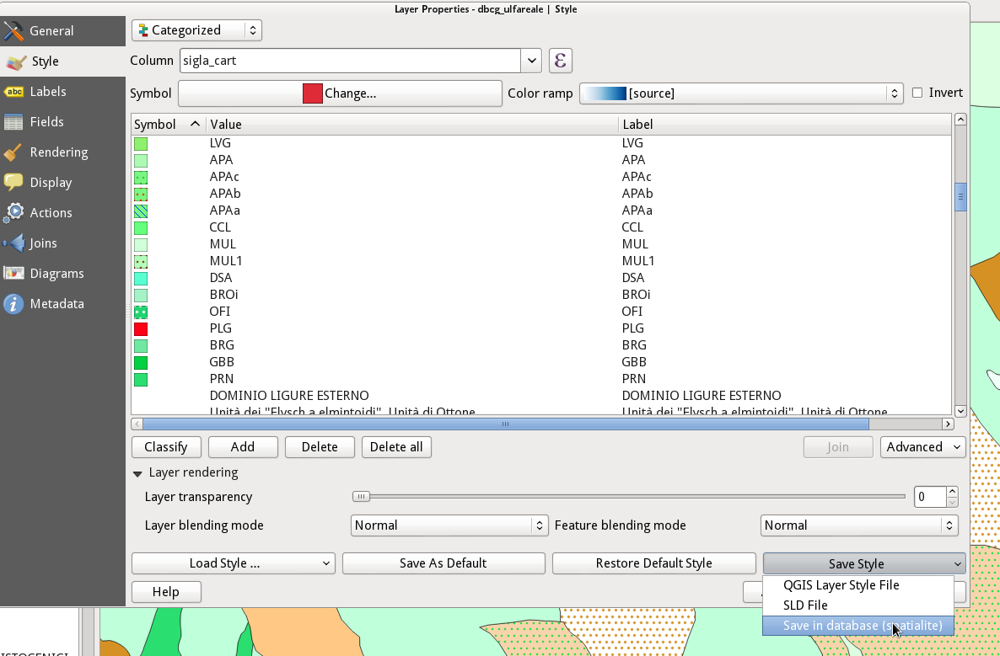


