

# Changelog for QGIS 3.32 {#changelog332}

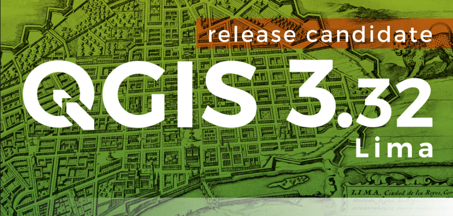

Release date: 2023-06-26

QGIS 3.32 is a major release of the QGIS Project that brings a significant advancement in geospatial technology to the Open Source World. The developer community has introduced several new features and improvements to leverage the potential of geospatial data.

Amongst numerous quality of life improvements across a broad spectrum of existing features, the 3.32 release features the long awaited functionality for Native Point Cloud Processing in QGIS, allowing QGIS Desktop to become a powerful processing utility for LiDAR data.

This milestone achievement is thanks in large part to the contributions of the community to the effective [crowd funding campaign](https://www.lutraconsulting.co.uk/crowdfunding/pointcloud-processing-qgis/) which funded this development, the QGIS community and [Enhancement Proposals](https://github.com/qgis/QGIS-Enhancement-Proposals/issues/263) used for the effective governance of these contributions, the collaborative efforts of the development agencies involved, and of course the extraordinary contributions of individual developers who build these tools for the benefit of all.

This release also includes a wide variety of developer experience enhancements, extensions to new functionalities like the profile plots and processing frameworks, and a new framework for sensor data to tightly integrate QGIS with data collection apparatus and facilitate the creation of next-generation intelligent solutions.

For a whirlwind tour of all the new functionalities introduced, you can view the highlight reel video on YouTube at <https://www.youtube.com/watch?v=ZtE1Az-zpf0>

`
<iframe style="position:absolute;top:0;left:0;width:100%;height:100%" src="https://www.youtube.com/embed/ZtE1Az-zpf0" frameborder="0" allow="accelerometer; autoplay; clipboard-write; encrypted-media; gyroscope;" allowfullscreen></iframe>
`{.interpreted-text role="raw-html"}

QGIS is a community effort, and we would like to extend a big thank you to the developers, documenters, testers, and the many folks out there who volunteer their time and effort (or fund people to do so) to make these releases possible. From the QGIS community, we hope you enjoy this release! If you wish to donate time, money, or otherwise contribute towards making QGIS more awesome, please wander along to [QGIS.ORG](https://qgis.org) and lend a hand!

QGIS is supported by donors and sustaining members. A current list of donors who have made financial contributions large or small to the project can be seen on our [list of donors](https://qgis.org/en/site/about/sustaining_members.html#list-of-donors). If you would like to become an official project sustaining member, please visit our [sustaining member page](https://qgis.org/en/site/about/sustaining_members.html) for more details. Sponsoring QGIS helps us to fund our regular developer meetings, maintain project infrastructure, and fund bug-fixing efforts. A complete list of current sponsors is provided below - our very great thank you to all of our sponsors!

`
 <!-- to be filled via javascript loading of atom feed --> 
`{.interpreted-text role="raw-html"}

QGIS is free software and you are under no obligation to pay anything to use it - in fact, we want to encourage people far and wide to use it regardless of their financial or social status - we believe that empowering people with spatial decision-making tools will result in a better society for all of humanity.



## Map Tools

### Feature: Map tip preview

A map tip preview window has been added to the Raster and Vector layer properties dialog to enrich the experience of designing map tips.

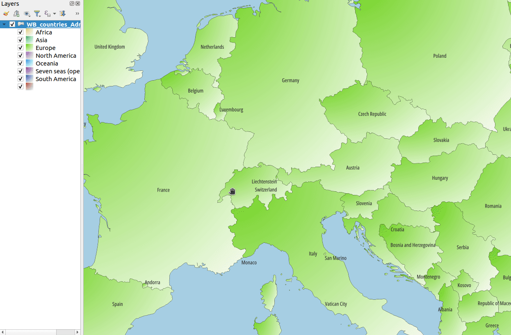

This feature was developed by [Yoann Quenach de Quivillic](https://github.com/YoannQDQ)

### Feature: Measure tool copy coordinates

The measurement dialog has been extended with the following functions:

-   X and Y columns with X and Y coordinates
-   The first row in the table contains only the coordinates (no distance)
-   A message is displayed when the copy has succeeded
-   A `Copy all` action is provided in a context menu on the table
-   Prevents errors when changing settings while measuring

Additional settings for managing the \"Copy All\" button behavior are provided to configure aspects such as separator, or including header information.

This feature was developed by [Yoann Quenach de Quivillic](https://github.com/YoannQDQ)

### Feature: Disable map tips for a specific layer

A new feature in the layer properties allows for disabling mapTips on a specific layer.

On the QGIS API, a `mapTipsEnabled` Q_PROPERTY was added to the `QgsMapLayer` class to enable this functionality.

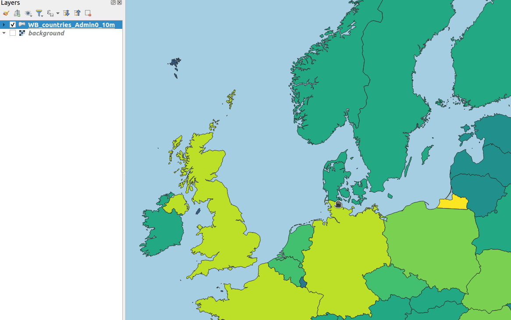

This feature was developed by [Yoann Quenach de Quivillic](https://github.com/YoannQDQ)

## User Interface

### Feature: Show value relation description when hovering the combobox

A description tooltip is now available when hovering the cursor over the value in the relation editor widget\'s combobox.

The description tooltip matches that of the currently selected item\'s description as defined in the \'description column\' on the value relation configuration panel.

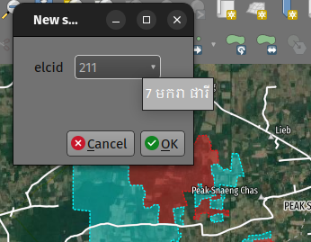

This feature was developed by [Mathieu Pellerin](https://github.com/nirvn)

### Feature: 2d map canvas view docking actions

The action to dock and undock 2d map canvas views has been added to match the behaviour of 3d canvas views.

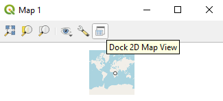

This feature was developed by [Nyall Dawson](https://github.com/nyalldawson)

### Feature: Add clear recently used crs button

The ability to remove \"recently used\" CRS information has been implemented in various ways, including:

-   Pressing the Del key while the list of recently used crs has focus remove the selected CRS
-   A column in the recent crs table with a button to clear individual CRS
-   A clear selected context menu action
-   A clear all recent CRS context menu action that will prompt the user for confirmation

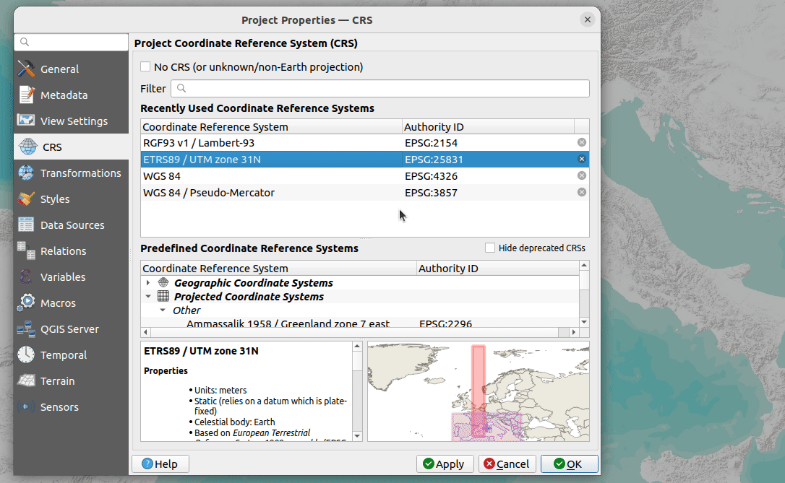

This feature was developed by [Yoann Quenach de Quivillic](https://github.com/YoannQDQ)

### Feature: Reverse wheel zoom

A setting is now available to reverse the zoom direction of the mouse wheel (scrolling forward zooms out)

This setting will affects wheel zooms in multiple contexts, including:

-   in the map canvas (`QgsMapCanvas`)
-   in the map overview (`QgsMapOverviewCanvas`)
-   in the layout view (`QgsLayoutView`)
-   in the layout map items when the \"move item content\" tool is active (`QgsLayoutViewToolMoveItemContent`)
-   in the Elevation profile canvas (`QgsElevationProfileCanvas`)
-   In the model editor graphic view (`QgsModelGraphicsView`)

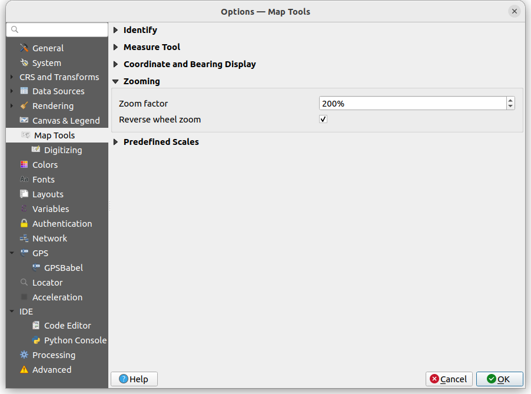

This feature was developed by [Yoann Quenach de Quivillic](https://github.com/YoannQDQ)

### Feature: Spatial bookmarks rotation

Map rotation can now be stored and applied in Spatial bookmarks, which includes a new context menu in the Spatial Bookmark Manager Panel.

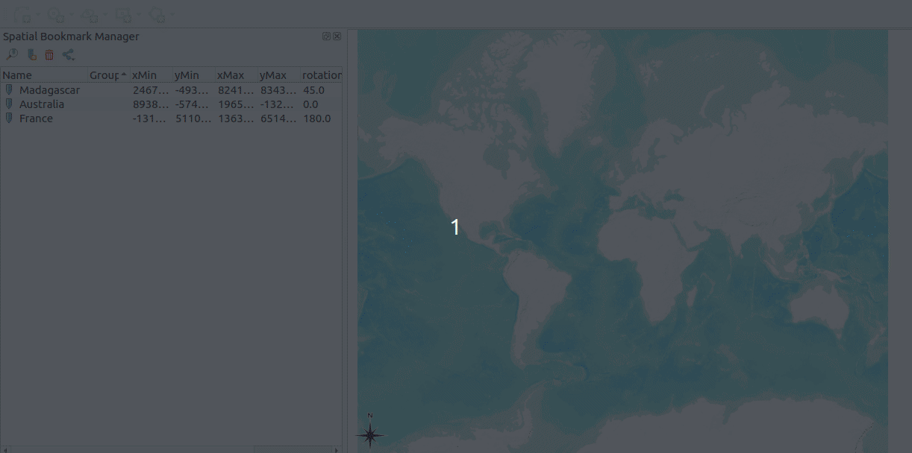

This feature was developed by [Yoann Quenach de Quivillic](https://github.com/YoannQDQ)

## Annotations

### Feature: Annotation tool improvements

A number of improvements have been made to the behavior of annotation tools including:

-   Preventing the resizing of an annotation when the cursor is not actually over the frame
-   Add a context menu (when an annotation tool is activated) on annotation items
-   Drop the undocumented `toggleTextItemVisibilities` (toggled Text annotations visibility with Ctrl+T)
-   Improve the selection and resizing behavior, including improvements for handling overlapping annotations

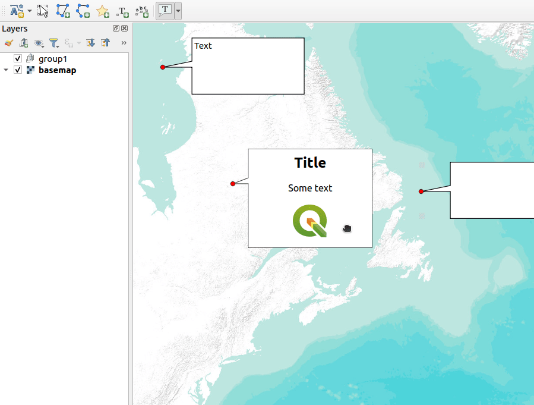

This feature was developed by [Yoann Quenach de Quivillic](https://github.com/YoannQDQ)

### Feature: Annotation live preview

A \"live update\" checkbox in the annotation editors allows for on the fly review of rendered annotation content.

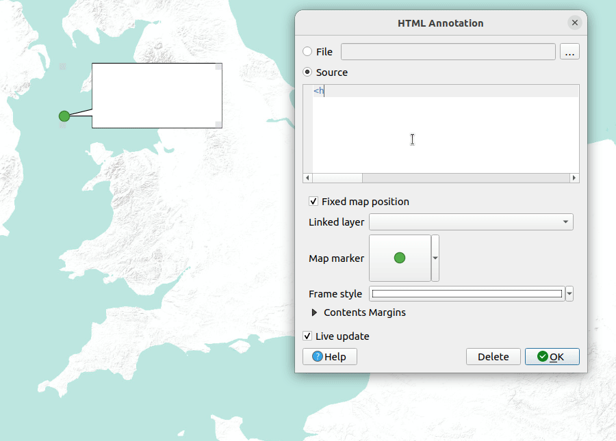

This feature was developed by [Yoann Quenach de Quivillic](https://github.com/YoannQDQ)

## 3D Features

### Feature: Improved 3d measure tool

The following improvements have been implemented to the measuring tool in 3d scenes:

-   Allows measuring on point cloud points
-   Display billboard circle markers on the 3d rubber band\'s vertices
-   Moving the mouse moves the rubber band\'s last vertex (although the measured results are not updated until user clicks)
-   Moving the camera does not remove current measurements
-   Allows using backspace and del keys to undo (remove last measurement)
-   Allows using Esc to clear measurements, matching the behavior of its 2d counterpart
-   Renders 3d rubberbands on top of other 3d entities so they don\'t get occluded

The object selection logic has also been refactored for more control, and the 3d identify tool was also enhanced to prevent interference with camera navigation as well as a bug fix for where the wrong FIDs were returned on specific cases.

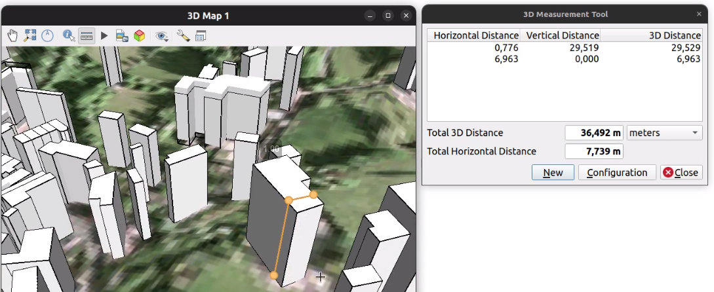

This feature was funded by [Point cloud processing and 3D data enhancements crowdfunding](https://www.lutraconsulting.co.uk/crowdfunding/pointcloud-processing-qgis/)

This feature was developed by [Stefanos Natsis](https://github.com/uclaros)

## Point Clouds

### Feature: Native point cloud Processing provider

A new native processing provider has been provided for point cloud algorithms, in line with [QEP 263](https://github.com/qgis/QGIS-Enhancement-Proposals/issues/263).

Under the hood provider utilizes the [pdal_wrench](https://github.com/PDAL/wrench) command line tool and currently supports the following algorithms:

-   Information: outputs a basic metadata of the point cloud (number of points, extent, crs, etc)
-   Convert format: convert point cloud to a different format, e.g. las to laz
-   Reproject: reproject point cloud to a different CRS
-   Fix projection: fix (assign) CRS of a point cloud file
-   Clip: clip point cloud by clipping polygon(s)
-   Merge: merge multiple point clouds in a single file
-   Tile: create tiles from input data
-   Thin: create a thinned version of the point cloud
-   Boundary: export vector layer containing point cloud boundaries
-   Density: export a raster file where each cell contains number of points that are in that cell\'s area
-   Export to raster: export point cloud data to a 2D raster grid
-   Export to vector: export point cloud data to a vector layer with 3D points
-   Export to raster (TIN): export point cloud data to a 2D raster grid using a triangulation of points
-   Filer: extract subset from the point cloud using PDAL expressions

As pdal_wrench requires PDAL \>= 2.5.0, the new processing provider will be available only where the PDAL version requirement is satisfied.

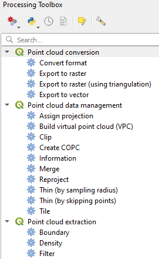

This feature was funded by [Point cloud processing and 3D data enhancements crowdfunding](https://www.lutraconsulting.co.uk/crowdfunding/pointcloud-processing-qgis/)

This feature was developed by [Alexander Bruy](https://github.com/alexbruy)

### Feature: Point cloud expression builder for Processing framework

A new point cloud expression builder widget is available within the GUI to create filters for point clouds in a user friendly manner consistent with the existing QGIS Expression Builder interfaces.

Within the QGIS API, the `QgsProcessingParameterExpression` parameter has been extended with the types `Qgis` and `PointCloud`. If parameter has a `PointCloud` type, it will use the point cloud expression builder widget. To maintain backward compatibility, by default an expression parameter will use the `Qgis` expression type.

The `QgsPointCloudExpression` class was also extended with a new method to convert QGIS point cloud expressions to [PDAL expressions](https://pdal.io/en/latest/stages/expression.html).

Existing PDAL algorithms using expression filters have been updated to use expression parameters instead of strings.

This feature was funded by [Point cloud processing and 3D data enhancements crowdfunding](https://www.lutraconsulting.co.uk/crowdfunding/pointcloud-processing-qgis/)

This feature was developed by [Alexander Bruy](https://github.com/alexbruy)

### Feature: Add filtering by rectangle and expression to PDAL algorithms

Added the option to filter input point cloud by rectangle (extent) and expression in the following PDAL algorithms:

-   boundary
-   clip
-   density
-   export to raster (normal and TIN variants)
-   export to vector
-   merge
-   thin

This allows the processing of only a subset of points from the input file(s), without the need to performing an intermediate filtering step or generating temporary files.

For these who need only filtering there is also a separate Filter algorithm capable of filtering either by extent, by expression or by their combination.

This feature was funded by [Point cloud processing and 3D data enhancements crowdfunding](https://www.lutraconsulting.co.uk/crowdfunding/pointcloud-processing-qgis/)

This feature was developed by [Alexander Bruy](https://github.com/alexbruy)

### Feature: New parameter type for point cloud attribute

Useful for point cloud algorithms involving attributes, like exporting specific attribute values as raster or filtering point clouds.

This also deprecates `parameterAsFields` API call, and `parameterAsStrings` should be used both for fields and point cloud attributes instead.

This feature was funded by [Point cloud processing and 3D data enhancements crowdfunding](https://www.lutraconsulting.co.uk/crowdfunding/pointcloud-processing-qgis/)

This feature was developed by [Alexander Bruy](https://github.com/alexbruy)

### Feature: Display virtual point clouds (VPC) in 3D views

Virtual point clouds can be rendered within 3d views. For performance management, a sub index threshold is specified so that the view will render the chunked entity of the point cloud only when appropriate and will instead render the bounding region of a particular sub index when the threshold criteria is not met.

This feature was funded by [Point cloud processing and 3D data enhancements crowdfunding](https://www.lutraconsulting.co.uk/crowdfunding/pointcloud-processing-qgis/)

This feature was developed by [Stefanos Natsis](https://github.com/uclaros)

### Feature: Virtual point clouds (VPC)

A new data provider is available for *Virtual Point Cloud* (VPC) files created by the [pdal_wrench](https://github.com/PDAL/wrench) utility and the *Build virtual point cloud (VPC)* tool in the newly introduced [Native point cloud Processing provider](https://github.com/qgis/QGIS-Enhancement-Proposals/issues/263).

The VPC file is handled as a single layer in QGIS and may contain a large number of point cloud files whose indexes are lazy loaded when the canvas is zoomed in enough. An extent renderer is used for the individual indexes while their extent fits the canvas\' width and the user defined renderer is only used when zoomed in further.

A Virtual Point Cloud is a JSON container file with a `.vpc` extension, referring to other files/URLs that contain the actual point cloud data. This is a concept similar to virtual rasters (VRTs) in GDAL. The JSON content is actually a STAC API ItemCollection. See [VPC specification](https://github.com/PDAL/wrench/blob/main/vpc-spec.md) for more details.

This feature was funded by [Point cloud processing and 3D data enhancements crowdfunding](https://www.lutraconsulting.co.uk/crowdfunding/pointcloud-processing-qgis/)

This feature was developed by [Stefanos Natsis](https://github.com/uclaros)

## Print Layouts

### Feature: Hyperlink support for HTML-enabled label exports

QGIS labels which contain HTML content will now support embedding functional hyperlinks in relevant layouts exports, such as PDFs.

This feature was funded by Kanton Schaffhausen

This feature was developed by [Mathieu Pellerin](https://github.com/nirvn)

### Feature: Support filtering layout legends by multiple linked map items

Instead of limiting layout legend filtering to a single linked map, this change permits legends to be filtered instead by multiple linked maps. It is designed to accommodate the use case where a layout has multiple maps, potentially at different scales and showing different extents, and a single legend is required which includes all symbols visible across all the maps.

The UX has been designed to avoid changing the current user workflows, in that legends will still be linked to a single main map item. This map is used when determining the scale (and other map dependent properties) at which to render the legend\'s symbols. Checking the \"Only show items inside linked maps\" option will still automatically filter the legend by the content of the main linked maps. However, there\'s a new \"\...\" options button next to the \"Only show items inside linked maps\" checkbox which allows users to select also other maps from their layout to consider when determining visible items:

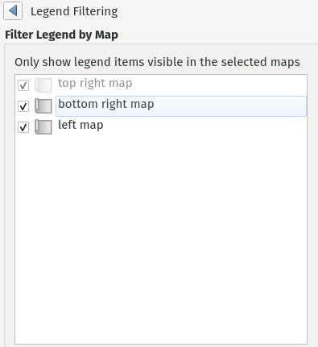

This feature was funded by City of Canning

This feature was developed by [Nyall Dawson](https://github.com/nyalldawson)

## Expressions

### Feature: Add ltrim/rtrim functions

Allows trimming spaces or other characters from just the start or end of strings

This feature was developed by [Nyall Dawson](https://github.com/nyalldawson)

## Digitising

### Feature: Field value list in merge feature dialog

When merging features, users may now select from a list of available values from the selected features, rather than manually capturing a manual value for a field.

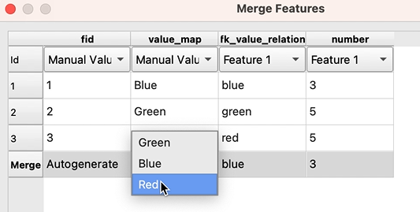

This feature was developed by [Denis Rouzaud](https://github.com/3nids)

### Feature: Common angle option extensions for advanced digitizing

The advanced digitizing options for common angles have been extended with the following functionalities:

-   New common angles for 0.1°, 0.5°, and 1.0°
-   A new option has been added to show current common angle in the floater context widget
-   New \'N\' \'SHIFT+N\' keyboard shortcuts are available to cycle through the common angle options

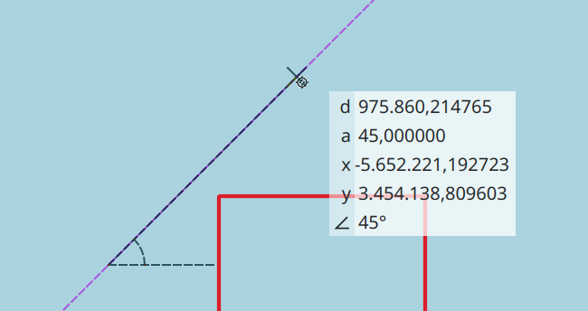

This feature was funded by ChartWorld International

This feature was developed by [Alessandro Pasotti](https://github.com/elpaso)

### Feature: Floater settings and bearing information for advanced digitizing

A new configuration setting for the advanced digitizing tool allows users to toggle the display of the \"floater\" contextual menu which follows the cursor during digitizing. Additional options are included for adding information to the floater panel, such as the display of bearing and azimuth information.

This feature was funded by ChartWorld International

This feature was developed by [Alessandro Pasotti](https://github.com/elpaso)

## Attribute table

### Feature: Improve loading time of attribute tables with hidden fields

Improve attribute table loading time when there are hidden virtual fields and (in a more limited way) when there are hidden non-virtual fields.

This feature was funded by QTIBIA Engineering and QCooperative.

This feature was developed by [Alessandro Pasotti](https://github.com/elpaso)

## Data Management

### Feature: Allow a range of cells to be copied from SQL results window

Allows selection of a range of cells to copy to clipboard. Results are copied as both plain text and html, so can be pasted easily into spreadsheet apps/etc as tables

This feature was developed by [Nyall Dawson](https://github.com/nyalldawson)

### Feature: Modified New field dialog behavior and alias support

When creating new fields, the \'Comment\' option is now only exposed for datasources which support editing comments (preventing QGIS from silently discarding the information).

This also adds support for setting field aliases within the new field dialog, and extends field comments and aliases for supported OGR formats.

This feature was developed by [Nyall Dawson](https://github.com/nyalldawson)

### Feature: Add DistanceUnit value for inches

Inches are now included as valid map units within QGIS.

This feature was developed by [Nyall Dawson](https://github.com/nyalldawson)

### Feature: Record split policy selection in form dialog

A new \"field split policy\" choice item is exposed in the layer properties form dialog. That allows users to easily determine the current policy for splitting a field and change as required.

The following policies have been provided:

-   duplicate values
-   remove values
-   use default value
-   use ratio of geometries

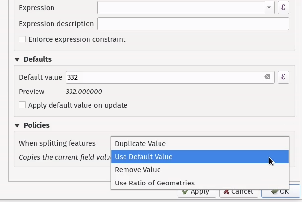

This feature was developed by [Nyall Dawson](https://github.com/nyalldawson)

## Forms and Widgets

### Feature: Add control over horizontal / vertical stretch for attribute form widgets

This functionality exposes two new \"size\" options for edit form widgets, allowing control over the horizontal and vertical stretch factors for the widget. By setting a horizontal or vertical stretch, users can control how edit widgets will relatively resize when resizing an attribute form.

For example, a user can set a higher horizontal stretch value for widgets which should \"grab\" more of the available horizontal space, such as for those widgets which are expected to have longer values. Similarly, the vertical stretch setting (available for select widget types) will control how widgets grow vertically when resizing forms, relative to the form dialog.

Together these options give more control to users over the exact layout and sizing of their attribute forms.

By default, the stretch values are set to \"Default\" which is the same as the behavior exhibited in previous versions of QGIS.

This feature was developed by [Nyall Dawson](https://github.com/nyalldawson)

### Feature: Add new attribute form container type \"Row\"

This container always lays out child widgets in a horizontal row, where the number of columns is automatically determined by the number of child widgets.

It\'s useful for creation of compact forms, where no space will be wasted by assigning extraneous horizontal width to widgets where the expected values will always be short.

Eg: creating 3 rows with 3, 2, 1 child widgets respectively results in the layout:

    Attr 1: [...] Attr 2: [...] Attr 3: [...]
    Attr 4: [..........] Attr 5: [..........]
    Attr 6: [...............................]

Without the option of row containers then the all horizontal rows will have the same number of columns, eg:

    Attr 1: [...] Attr 2: [...] Attr 3: [...]
    Attr 4: [...] Attr 5: [...] Attr 6: [...]

(leaving insufficient horizontal length for attributes 4-6), or

    Attr 1: [..........] Attr 2: [..........]
    Attr 2: [..........] Attr 3: [..........]
    Attr 4: [..........] Attr 5: [..........]
    Attr 6: [..........]

(resulting in wasted horizontal space next to attribute 6, and an extra row taking up vertical space)

This feature was funded by NIWA

This feature was developed by [Nyall Dawson](https://github.com/nyalldawson)

## Processing

### Feature: Download vector tiles algorithm

A new Processing algorithm has been added which enables the downloading of vector tiles from a remote server. This functionality includes vector tile support for the map layer parameter, as well as a new vector tile destination parameter for Processing algorithms. The output MBTiles format files can also be automatically added to the canvas after processing.

This feature was funded by [Mergin Maps](https://merginmaps.com/)

This feature was developed by [Alexander Bruy](https://github.com/alexbruy)

### Feature: Allow configuration of the order of outputs created by a model

A new \"Reorder Output Layers\" action to the model designer menu has been added which allows model creators to set a specific order which the outputs from their model must use when loading the results into a project. This gives the model creator a means of ensuring that layers are logically ordered on the canvas when running a model, such as placing a vector layer output over a raster layer output, or a point layer over a polygon layer.

The model creator can also set an optional \"Group name\" for the outputs for automatically grouping outputs within the layer tree using a new group name or by adding them to an existing group.

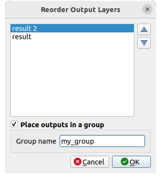

This feature was funded by [QGIS User Group Germany](https://qgis.de/)

This feature was developed by [Nyall Dawson](https://github.com/nyalldawson)

### Feature: Algorithm to create COPC files for input point clouds

A new algorithm adds the \"Create COPC\" option to the PDAL provider for generating Cloud Optimized Point Clouds. The algorithm creates a COPC file for each input point cloud file and can be useful for indexing files before using them in QGIS, or when building a VPC.

This feature was funded by [Point cloud processing and 3D data enhancements crowdfunding](https://www.lutraconsulting.co.uk/crowdfunding/pointcloud-processing-qgis/)

This feature was developed by [Alexander Bruy](https://github.com/alexbruy)

### Feature: Add invert selection tool on refactor fields processing tool

A new button has been added to the field management interface of the refactor fields processing tool button which allows users to invert the selection. This allows for more efficient management of fields such as enabling bulk field deletes.

This feature was added during the [QGIS Contributor Meeting 2023, s-hertogenbosch](https://github.com/qgis/QGIS/wiki/25th-Contributor-Meeting-in-'s-Hertogenbosch)

This feature was funded by [camptocamp](https://camptocamp.com)

This feature was developed by [Ismail Sunni](https://github.com/ismailsunni)

### Feature: Support field comments and aliases in processing algorithms

This adds support for handling field comments and aliases in the processing \"add field to attributes table\" and \"refactor fields\" algorithms. Additionally, it ensures that field comments and aliases are copied from source layers to destination layers when present.

If the output layers do not support comments/ aliases then user-friendly warnings are shown in the processing log advising users of the limitation.

This feature was developed by [Nyall Dawson](https://github.com/nyalldawson)

### Feature: Build virtual point cloud (VPC) algorithm

The new algorithm allows user to build [virtual point cloud (VPC)](https://github.com/PDAL/wrench/blob/main/vpc-spec.md) files that reference multiple existing point cloud datasets. This allows then visualization and processing of many point cloud files as a single layer in QGIS.

Additional options are available for the \"Build VPC\" Processing algorithm, which provide the following utilities for building Virtual Point Clouds:

-   calculate statistics from input data
-   calculate exact boundaries from input data
-   build an overview point cloud

This feature was funded by [Point cloud processing and 3D data enhancements crowdfunding](https://www.lutraconsulting.co.uk/crowdfunding/pointcloud-processing-qgis/)

This feature was developed by [Alexander Bruy](https://github.com/alexbruy)

### Feature: Thread management in algorithm settings

A handy new environment configuration setting has been created for the configuration of the number of threads an algorithm should use when an algorithm is capable of using several cores, such as TauDEM or PDAL.

This functionality has been applied to the PDAL and TileXYZ algorithms.

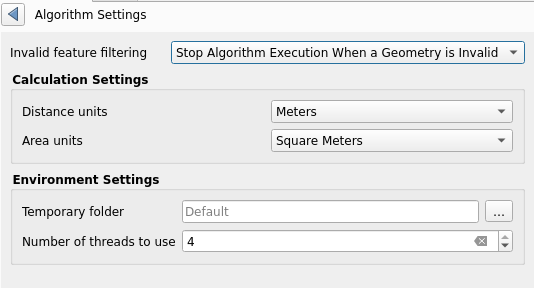

This feature was developed by [Alexander Bruy](https://github.com/alexbruy)

### Feature: Allow temporary folder to be temporarily changed through the algorithm settings panel

Individual processing algorithms may now include an environment setting to specify a custom temporary folder which overwrites the configured temporary file path. This is useful in situations where a particular tool may use a lot of temporary disk space and a dedicated location or scratch disk is required, or when a particular operation requires performance enhancements offered by a particular disk or path.

This feature was developed by [Nyall Dawson](https://github.com/nyalldawson)

### Feature: Allow processing dialog to override default processing context settings

A new \"Algorithm Settings\" action has been added to the Advanced button of the processing algorithms interface. Selecting it shows a panel which allows users to control general processing settings which apply to a **particular instance** of the algorithm execution. It\'s intended to be a place where a user can override their global processing settings on an ad-hoc basis without having to change their usual default settings.

Includes settings for:

-   invalid geometry handling (Unlike the existing per-parameter setting override for this, setting the handling method here will apply to ALL inputs for the algorithm)
-   distance unit and area units to use for distance/area measurements

This feature was developed by [Nyall Dawson](https://github.com/nyalldawson)

### Feature: Additional parameters for gdal2xyz algorithm

The gdal2xyz processing algorithm from the GDAL processing provider now includes parameters for `skipnodata` and `src`, and `dstnodata`.

This feature was developed by [Luke Pinner](https://github.com/lpinner)

### Feature: Add \"Keep disjoint results separate\" option to buffer algorithm

If checked, then any disjoint parts in the buffer results will be output as separate single-part features. This setting is designed to expose a similar functionality as is available for the \'dissolve\' algorithm.

This feature was funded by City of Canning

This feature was developed by [Nyall Dawson](https://github.com/nyalldawson)

### Feature: Allow filter expressions to be set for vector sources

This change adds a new \"feature filter\" option alongside the existing feature limit and invalid geometry handling options available for all vector inputs to processing layers.

It allows users to enter an expression to subset the layer dynamically when running the tool, avoiding the need for separate steps to set layer filters or create layer subsets.

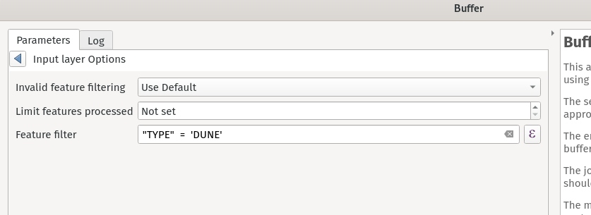

This feature was funded by City of Canning

This feature was developed by [Nyall Dawson](https://github.com/nyalldawson)

### Feature: Support \*.HEIC format images in Processing \"Import Photos\" algorithm

The Import Photos algorithm now allows importing `*.heic` images with GDAL\'s HEIF image support.

This feature was developed by [Chris Shucksmith](https://github.com/shuckc)

## Application and Project Options

### Feature: Settings editor updates

The interface for settings editors have seen a major overhaul and the advanced settings interface has the following user facing changes:

-   A choice of using the old or the new settings widget, which is remembered
-   A \"hidden\" setting allows to bypass the warning before showing the settings tree
-   Settings have dedicated editors (spin box, checkbox, colorbutton, etc.)
-   The modification of settings is now only executed when apply is pressed
-   Current settings are displayed in italic, whereas settings to which changes will be applied are displayed in red

In addition, the settings API has undergone significant changes including:

-   Removal of the QgsSettingsEntryByValue class, using the by reference only
-   The old QgsSettingsTreeWidget has been renamed to QgsSettingsTreeWidgetOld (in app)

New API classes introduced include:

-   QgsSettingsTreeWidget and QgsSettingsTreeModel: tree widget + model to show and edit the settings
-   QgsSettingsEditorWidgetWrapper (pure virtual): a base wrapper class to create and handle a setting editor widget
-   QgsSettingsEditorWidgetWrapperTemplate (pure virtual): the base class for the wrapper of settings declared in C++ API (using typed methods)
-   Classes for settings editors: QgsSettingsStringEditorWidgetWrapper, etc.
-   QgsSettingsEditorWidgetRegistry: a registry of the setting editor wrappers

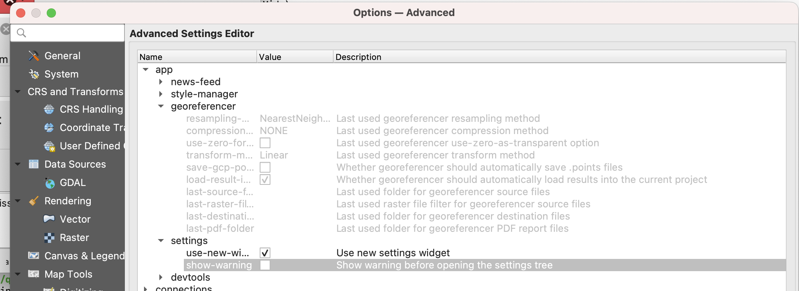

This feature was developed by [Denis Rouzaud](https://github.com/3nids)

### Feature: User profile selector

In previous versions of QGIS, when QGIS Desktop was closed the current profile would be saved in the profiles.ini configuration file, so the default profile was the profile used in the last instance of QGIS that was closed.

A new User selection policy feature allows users to select how default profiles are defined, in accordance with the following three options:

-   Last Profile: The legacy mode which follows previous version behavior. This uses the last closed profile when opening a new instance of QGIS.
-   Default Profile: Manually define a default profile among the existing profile that will always be used by default (without using a command line flag or electing a profile from within the QGIS UI)
-   Let user choose at startup

When \"Let user choose\" is selected, if there are 2 or more profiles, a selection dialog is displayed before the SplashScreen which will allow the user to choose which profile to use or to create a new profile which will be loaded automatically.

Regardless of the selected policy, if only one profile exists it will be used, and if no profile exist, the default profile will be created and used.

User profile icons are also provided to allow users to visually differentiate between their active profiles.

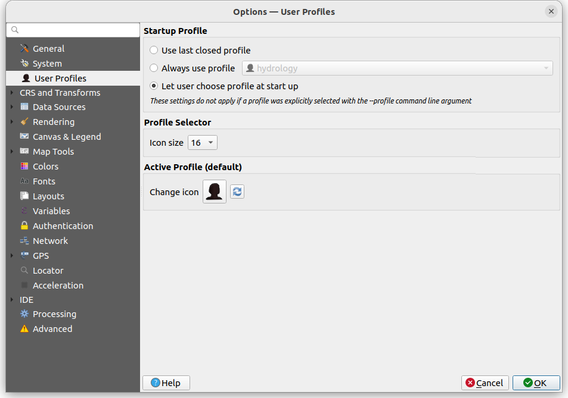

This feature was developed by [Yoann Quenach de Quivillic](https://github.com/YoannQDQ)

## Profile Plots

### Feature: Distance unit selection for elevation profiles

Users may now choose from a selection of distance units to override the default (Canvas CRS map units) for elevation profiles in both the interactive elevation profiles (via the settings toolbar button) and for layout elevation profiles.

In layout profiles, there is an additional option which controls where the distance unit suffixes should be placed. The following options are available to manage the display of unit suffixes:

-   hide the suffixes
-   display for all values
-   display for the first value
-   display for the last value
-   display for both the first and last values.

Note that it is currently not possible to expose unit selection for the vertical axis, as this is currently dimensionless and will require the development of vertical CRS handling in QGIS as outlined in [QEP 267](See%20https://github.com/qgis/QGIS-Enhancement-Proposals/issues/267).

This feature was funded by [Point cloud processing and 3D data enhancements crowdfunding](https://www.lutraconsulting.co.uk/crowdfunding/pointcloud-processing-qgis/)

This feature was developed by [Nyall Dawson](https://github.com/nyalldawson)

### Feature: Export elevation profiles

A new item has been added to the elevation profile toolbar, which includes various options for exporting elevation profiles.

Profile plots can now be exported as:

-   3D Features: exports the profile line as 3d cross sections, with z values taken from the elevation slices
-   2D Profile: exports the profile as a distance vs elevation chart (i.e. as shown in the elevation profile widget)
-   Distance/Elevation Table: exports sample distance vs elevation values as a table

The results can be saved as DXF files, CSV files, or any of the standard writable vector spatial formats shapefile geopackages.

This feature was funded by [Point cloud processing and 3D data enhancements crowdfunding](https://www.lutraconsulting.co.uk/crowdfunding/pointcloud-processing-qgis/)

This feature was developed by [Nyall Dawson](https://github.com/nyalldawson)

### Feature: Add layers to elevation profiles

1.  An explicit \"Add Layers\" button has been added to the elevation profile dock. This provides a user-friendly why of adding new layers to a plot - clicking it will show a filtered list of possible layers which can be added to the plot, but which currently aren\'t in the plot (i.e it will include all raster layers from the project which aren\'t marked as having elevation data). Selecting layers will cause them to automatically be marked as having elevation data and immediately added to the plot.
2.  Layers can now be added to elevation plots via drag and drop from the layer tree. Unfortunately, users will have to explicitly hold the \"Ctrl\" key while dragging in order to force the copy action due to upstream library limitations.

This feature was funded by [Point cloud processing and 3D data enhancements crowdfunding](https://www.lutraconsulting.co.uk/crowdfunding/pointcloud-processing-qgis/)

This feature was developed by [Nyall Dawson](https://github.com/nyalldawson)

### Feature: Add \"Fill Above\" mode for elevation profile drawing

The new fill above drawing mode for profile plots also includes additional options to limit the extent of \"fill above\" and \"fill below\" elevation ranges for a layer.

This feature was developed by [Nyall Dawson](https://github.com/nyalldawson)

### Feature: Add option to lock the horizontal/ vertical scale to matching scales

When activated, this option ensures that the horizontal and vertical scales are always kept equal. For instance, a 45 degree slope will always appear as a 45 degree slope in the profile.

This feature was funded by [Point cloud processing and 3D data enhancements crowdfunding](https://www.lutraconsulting.co.uk/crowdfunding/pointcloud-processing-qgis/)

This feature was developed by [Nyall Dawson](https://github.com/nyalldawson)

## Sensors

### Feature: Core sensors framework

A core sensors framework provides a sensor types registry, a sensor manager, and three simple QIODevice-based sensor types as follows:

-   TCP socket
-   UDP socket
-   Serial port

A sensor manager is attached to project instances that allows users to register sensors within their project files. Contrary to other inputs such as a positioning device, sensors are considered to be much more project-specific data inputs. The big advantage of project-based sensors is that it makes those much more portable and easier to share across users.

A new `sensor_data()` function is added to the project scope which is available using expressions, that returns the latest captured sensor data values for a specific sensor name. An optional expiration (in milliseconds) parameter allows for expressions that will reject a specific sensor value is older that the provided expiration value.

This feature was funded by [Sevenson Environmental Services](https://sevenson.com/)

This feature was developed by [Mathieu Pellerin](https://github.com/nirvn)

### Feature: Sensors GUI registry and configuration widgets

Configuration widgets are provided for the TCP, UDP, and serial port sensor types which will allow users to configure, add, and remove sensors within the project properties dialog\'s sensors panel.

The implementation includes a sensor GUI registry to easily allow for additional python sensors to be created and shipped as plugins.

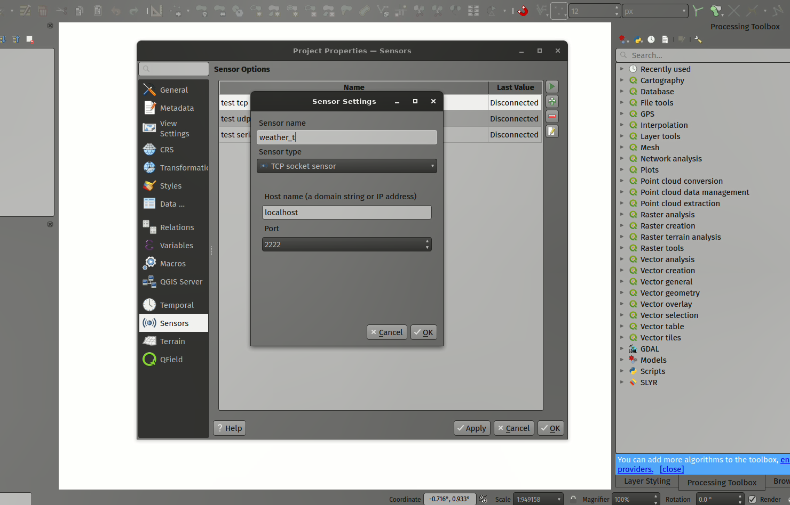

This feature was funded by [Sevenson Environmental Services](https://sevenson.com/)

This feature was developed by [Mathieu Pellerin](https://github.com/nirvn)

### Feature: Sensor options panel within the project properties dialog

A sensor table widget is provided that displays registered sensors within a project, along with with actions to connect and disconnect from sensors. The table is accessible via a new sensors panel in the project properties dialog.

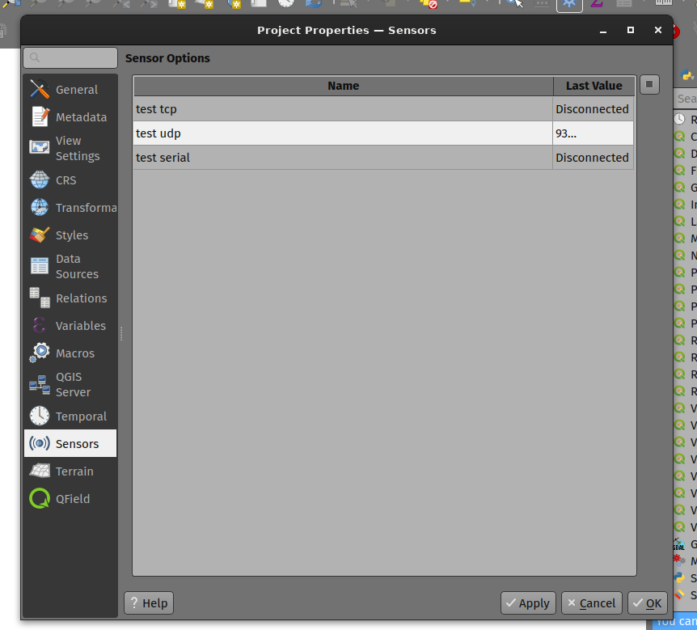

This feature was funded by [Sevenson Environmental Services](https://sevenson.com/)

This feature was developed by [Mathieu Pellerin](https://github.com/nirvn)

## Browser

### Feature: Set field comments in browser

When supported by providers, a new browser context menu action for fields allows for users to set/change the field\'s comments in the datasource.

Currently supported for OGR formats with field comment capabilities such as GPKG, ESRI File Geodatabase, NetCDF, or Geoparquet, as well as PostgreSQL data sources.

This feature was developed by [Nyall Dawson](https://github.com/nyalldawson)

### Feature: Set field aliases in browser

When supported by providers, a new browser context menu action for fields allows for users to set/change the field\'s alias in the datasource.

Currently supported for OGR formats with field comment capabilities such as GPKG, ESRI File Geodatabase, NetCDF, or Geoparquet.

This feature was developed by [Nyall Dawson](https://github.com/nyalldawson)

## Data Providers

### Feature: Load layers in parallel threads when opening project

QGIS will now load supported layers in parallel when loading a project, significantly improving project load times in certain instances such as when a project includes numerous remote layers.

To load a layer on a parallel worker thread, the layer data provider must support parallel loading (currently GDAL and PostgreSQL providers).

A new advanced setting is available to deactivate this behavior when necessary.

This feature was funded by [KoBold Metals](https://www.koboldmetals.com/)

This feature was developed by [Vincent Cloarec](https://github.com/vcloarec)

### Feature: Implements server-side filtering using Part 1 or Part 3

The WFS/ OGC API for Features (OAPIF) data provider has been extended to support enhanced filtering criteria in line with open standards.

New functionalities include:

-   Support for filtering on feature properties (OGC API Features Part 1 - /rec/core/fc-filters). This uses the /api endpoint to get the list of queryable items.
-   Support for filtering based on OGC API Features Part 3 - CQL2-text
-   Pass selected CRS to query builder UI
-   Implement a getFeature() expression translation

For the CQL2text compatibility, the server `/conformance` implementation is required to declare at least the following data:

-   <http://www.opengis.net/spec/ogcapi-features-3/1.0/conf/filter>
-   <http://www.opengis.net/spec/ogcapi-features-3/1.0/conf/features-filter>
-   <http://www.opengis.net/spec/cql2/1.0/conf/cql2-text>
-   <http://www.opengis.net/spec/cql2/1.0/conf/basic-cql2>

The `/collections/{collid}/queryables` endpoint is requested to get the queryable properties.

Additional conformance classes for advanced filtering include the following items:

-   <http://www.opengis.net/spec/cql2/1.0/conf/advanced-comparison-operators>: for IN, BETWEEN, LIKE
-   <http://www.opengis.net/spec/cql2/1.0/conf/case-insensitive-comparison>: for ILIKE
-   <http://www.opengis.net/spec/cql2/1.0/conf/basic-spatial-operators>: for `intersects(geomcolumn, geomFromWkt('POINT(x y)'))` and `bbox_intersects(geomcolumn, geomFromWkt('WKT LITERAL'))`

This feature was developed by [Even Rouault](https://github.com/rouault)

### Feature: Expose option to load vector tile sources from files in Data Source Manager

The Vector Tile tab now includes choices for selecting from a \"Service\" (the existing, connection based approach for adding vector tiles from online sources) or \"File\" (a new option which allows directly adding a data source using VTPK or MBTiles vector tile files).

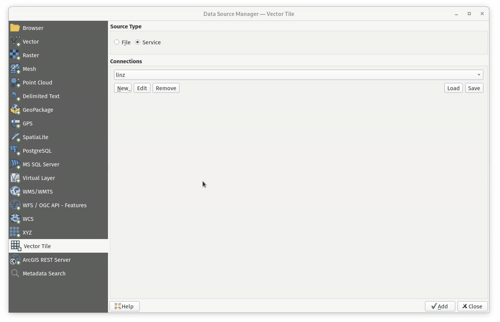

This feature was funded by Landesamt für Vermessung und Geoinformation, Feldkirch, Austria

This feature was developed by [Nyall Dawson](https://github.com/nyalldawson)

### Feature: Additional user controlled vector tile properties

Vector tile data sources now support user defined controls for layer opacity and blending modes.

Additionally, it adds the standard \"Source\" and \"Rendering\" tabs to the vector tile layer properties dialog. The Rendering tab contains the layer\'s scale based visibility (just like for other layer types), and the source tab contains the layer name, crs override and provider-specific source controls.

Source widgets are also for the VTPK and MBTiles vector tile providers, allowing control over the source vtpk/mbtiles file path.

This feature was developed by [Nyall Dawson](https://github.com/nyalldawson)

### Feature: Fix broken layer support for vtpk/mbtile vector tile layers, show vtpk files in browser

Vector tile layers now expose all the required API items for supporting broken layer handling and discovery, making their behavior consistent with other layer types. Additionally, by implementing the modern provider metadata APIs for the VTPK provider we ensure that VTPK files are shown in the browser panel for easy discovery.

This feature was funded by Landesamt für Vermessung und Geoinformation, Feldkirch, Austria

This feature was developed by [Nyall Dawson](https://github.com/nyalldawson)

## QGIS Server

### Feature: PDF format options for WMS GetPrint

The `FORMAT_OPTIONS` parameter in QGIS Server can now also be used to pass format options for PDF format to WMS GetPrint. This allows more control in GetPrint requests when generating GeoPDF outputs, such as Georeference or Geometry Simplification settings.

This feature was developed by [mhugent](https://github.com/mhugent)

### Feature: Configurable capabilities cache size

The QGIS Server GetCapabilities request cache size can now be configured with the `QGIS_SERVER_CAPABILITIES_CACHE_SIZE` parameter, which uses an integer input specifying the number of requests to cache. A notice of \"Removed cached WMS capabilities document\" will be logged when all slots are taken and a cached document is dropped.

This feature was developed by [Jürgen Fischer](https://github.com/jef-n)

### Feature: Add display name in GetFeatureInfo response

A new `WITH_DISPLAY_NAME` parameter will add the display name in the `GetFeatureInfo` response if needed, similar to the existing `WITH_MAPTIP` parameter.

This feature was funded by [3liz.com](https://3liz.com)

This feature was developed by [Étienne Trimaille](https://github.com/Gustry)

### Feature: OGC API - Features: Add full pagination for collection items HTML page

To make browsing the features more user friendly and provide more information, the following was implemented and added to the HTML template:

-   full pagination which shows always the total number of pages
-   configurable pagesize via dropdown
-   number of matching items
-   number of returned items
-   pagesize/pagination controls also at the bottom of the page

This feature was developed by [Björn Hinkeldey](https://github.com/pathmapper)

## Programmability

### Feature: Python console help improvements

A special `?` command has been added to the python console which displays a useful help message, identifies some key variables, and provides helper functions for improving the developer experience within QGIS Desktop.

The `_pyqgis` and `_api` helper functions will take a parameter (an instance or class), and will display the matching object page from the QGIS or Qt documentation.

This feature was developed by [Yoann Quenach de Quivillic](https://github.com/YoannQDQ)

### Feature: Run shell commands from the Python Console

The QGIS Python ConsoleMimics IPython behavior to run system commands.

-   Run any command that works at the command-line with the syntax `!<cmd>`. The console will start a subprocess, and forward its output to the Python Console Output.
-   While the subprocess is running, the Python Console Input switch to STDIN mode and forwards entered character to the child process. This make it possible to send confirmation when the child program ask for it.
-   This provides easy access to commands such as pip for the simple installation and removal of dependencies directly within the QGIS project context
-   When the Console is in STDIN mode, pressing Ctrl+C will kill the subprocess.
-   Affect the result of a command to a variable with the syntax `var = !cmd`

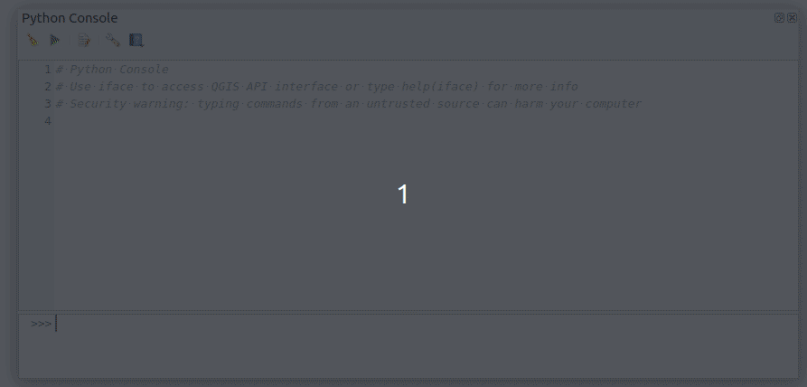

This feature was developed by [Yoann Quenach de Quivillic](https://github.com/YoannQDQ)

### Feature: Reformat code action for code editors

A \"format code\" action has been added to the Python Console Editor which allows for the automated linting/ pretty printing of code in line with the capabilities of modern code editors.

Additional configuration settings for this action include:

-   Format on save: if enabled, formatting is applied just before saving the script
-   Sort imports: Sort import statements using isort
-   Max line length: Control how the formatter will wrap the lines, and controls the editor ruler

The Formatter options allow for a selection between the autopep8 or black linting tools and provide the following additional options:

-   Level (autopep8 only) See [Autopep8 aggressiveness level](https://pypi.org/project/autopep8/#more-advanced-usage)
-   Normalize quotes (black only): Replace all single quotes with double quotes if possible

Sorting operations are provided using isort, which will allow for sorting import statements in three different groups:

-   standard library imports (re, os, sys, json, \...)
-   third-party modules (PyQt5, pandas, dateutil, \...)
-   first-party modules (qgis, processing, \...)

These operations will facilitate consistent development in line with industry best practices and improve code quality, consistency, readability, and operational efficiency (especially when coupled with version control systems).

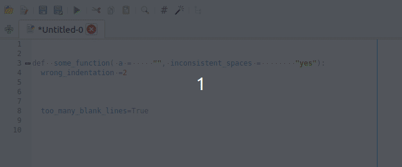

This feature was developed by [Yoann Quenach de Quivillic](https://github.com/YoannQDQ)

### Feature: Toggle Python console to full main window

Adds the same toggle button 3d map canvases and attribute tables to make it super-easy to switch the Python console to a full main window or back to a docked widget.

This feature was developed by [Nyall Dawson](https://github.com/nyalldawson)

### Feature: Reformat HTML Code in Code Editors

Editors using the `QgsCodeEditorHTML` class will be able to use the code reformatting functionality to pretty print HTML data within QGIS. Note that this functionality will require the BeautifulSoup4 or lxml libraries to be installed within the python environment to parse the XML/ HTML data.

This feature was developed by [Yoann Quenach de Quivillic](https://github.com/YoannQDQ)

## Notable Fixes

### Feature: Bug fixes by Even Rouault (Spatialys)

  ----------------------------------------------------------------------------------------------------------------------------------------------------------------------------------------------------------------------------------------------------------------------------------------------------------------------
  Bug Title                                                                   URL issues (Github, if reported)                      URL Commit (Github)                                                       3.28 backport commit (GitHub)
  --------------------------------------------------------------------------- ----------------------------------------------------- ------------------------------------------------------------------------- ----------------------------------------------------------------------------------------------------------
  GeoJSON IDs are barely supported (only reading string IDs is supported)     [#53214](https://github.com/qgis/QGIS/issues/53214)   Just analysis - fix out of scope                                          unreported - \[cleanup\] QgsOgrFeatureIterator(): remove (hopefully!) useless code in subset string case

  \"Order by\" memory leak                                                    [#53198](https://github.com/qgis/QGIS/issues/53198)   [PR #53266](%5BPR%20#53266%5D(https://github.com/qgis/QGIS/pull/53266))   N/A

  Browser very slow when opening directory containing several GDB             [#53265](https://github.com/qgis/QGIS/issues/53265)   [PR #53267](%5BPR%20#53267%5D(https://github.com/qgis/QGIS/pull/53267))   Doesn\'t build with armv7 on openSUSE Tumbleweed

  Add .pgwx as potential world file types for georeferenced png               [#53125](https://github.com/qgis/QGIS/issues/53125)   [GDAL PR 7864](https://github.com/OSGeo/gdal/pull/7864)                   N/A - GDAL fix

  Assertion failed when filtering a GeoParquet layer                          [#53301](https://github.com/qgis/QGIS/issues/53301)   [GDAL PR 7882](https://github.com/OSGeo/gdal/pull/7882)                   N/A - GDAL fix

  Given URL parameters do not persist for WFS OGC API - Features connection   [#49154](https://github.com/qgis/QGIS/issues/49154)   tried to reproduce - too complicated                                      Field domain created incorrectly

  Field domain created incorrectly                                            [#52318](https://github.com/qgis/QGIS/issues/52318)   [PR #53314](https://github.com/qgis/QGIS/pull/53314)                      [PR #53349](https://github.com/qgis/QGIS/pull/53349)

  Longer opening time of GPKG file in newer versions                          [#53525](https://github.com/qgis/QGIS/issues/53525)   [PR #53566](https://github.com/qgis/QGIS/pull/53566)                      TODO
  ----------------------------------------------------------------------------------------------------------------------------------------------------------------------------------------------------------------------------------------------------------------------------------------------------------------------

This feature was funded by [QGIS.ORG (through donations and sustaining memberships)](https://qgis.org/)

This feature was developed by [Even Rouault (Spatialys)](https://www.spatialys.com/)

### Feature: Bug fixes by Sandro Santilli (strk)

  ---------------------------------------------------------------------------------------------------------------------------------------------------------------------------------------------------------------------------
  Bug Title                                            URL issues (Github, if reported)                      URL Commit (Github)                                       3.28 backport commit (GitHub)
  ---------------------------------------------------- ----------------------------------------------------- --------------------------------------------------------- ------------------------------------------------------
  QGIS offset line shows perpendicular tags issue      [#53165](https://github.com/qgis/QGIS/issues/53165)   [PR #53234](https://github.com/qgis/QGIS/pull/53234)      [PR #53308](https://github.com/qgis/QGIS/pull/53308)

  strange behaviour of single sided buffer algorithm   [#52795](https://github.com/qgis/QGIS/issues/52795)   [geos PR 912](https://github.com/libgeos/geos/pull/912)   N/A - GEOS fix
  ---------------------------------------------------------------------------------------------------------------------------------------------------------------------------------------------------------------------------

This feature was funded by [QGIS.ORG (through donations and sustaining memberships)](https://qgis.org/)

This feature was developed by [Sandro Santilli (strk)](http://strk.kbt.io/)

### Feature: Bug fixes by Alessandro Pasotti (itOpen / qcooperative)

  ----------------------------------------------------------------------------------------------------------------------------------------------------------------------------------------------------------------------------------------------------------------------------------------------------------------------------------------------
  Bug Title                                                                                                        URL issues (Github, if reported)                      URL Commit (Github)                                    3.28 backport commit (GitHub)
  ---------------------------------------------------------------------------------------------------------------- ----------------------------------------------------- ------------------------------------------------------ ----------------------------------------------------------------------------------------------------------------
  Legend filter expression has an incomplete context                                                               [#53229](https://github.com/qgis/QGIS/issues/53229)   [PR #53296](https://github.com/qgis/QGIS/pull/53296)   queued

  LineString showing offset in CRS 3857 when using Vertex Tool and \"Clip Features to Canvas Extent\" is enabled   [#45200](https://github.com/qgis/QGIS/issues/45200)   [PR #53384](https://github.com/qgis/QGIS/pull/53384)   queued

  Qgis Server WMTS returns wrong WGS84BoundingBox for the layer                                                    [#53213](https://github.com/qgis/QGIS/issues/53213)   cannot reproduce                                       Form not showing (randomly) values except when triggering \"Editing Mode\"

  OGC API Features ignores \"X-Qgis-Service-Url\" header                                                           [#53367](https://github.com/qgis/QGIS/issues/53367)   won\'t fix                                             Fixed legend size is not respected when exporting a layout

  Snap to random vertices after splitting features                                                                 [#53040](https://github.com/qgis/QGIS/issues/53040)   cannot reproduce                                       Cartographic label placement with \"Distance Offset: From Symbol Bounds\" shows offset for MultiPoint features

  Layers rendered as a group seem to bypass the \"Lock Layers\" option in my print composer.                       [#53379](https://github.com/qgis/QGIS/issues/53379)   [PR #53428](https://github.com/qgis/QGIS/pull/53428)   queued but PR is still unreviewed

  Map Layout composer - Legend item expression not displaying correctly                                            [#53244](https://github.com/qgis/QGIS/issues/53244)   [PR #53434](https://github.com/qgis/QGIS/pull/53434)   not worth it, not critical

  opacities parameter doesn\'t apply to labels in GetMap requests                                                  [#48020](https://github.com/qgis/QGIS/issues/48020)   [PR #53438](https://github.com/qgis/QGIS/pull/53438)   queued but PR is still unreviewed

  The list in \"Link to existing child features\" does not help in selecting the right child features              [#53410](https://github.com/qgis/QGIS/issues/53410)   won\'t fix                                             Object Snap on Lines does not work for arc-elements

  Attribute form widgets are not disabled when \"Editable\" state is data-defined and layer is not in edit mode    [#53031](https://github.com/qgis/QGIS/issues/53031)   [PR #53506](https://github.com/qgis/QGIS/pull/53506)   N/A
  ----------------------------------------------------------------------------------------------------------------------------------------------------------------------------------------------------------------------------------------------------------------------------------------------------------------------------------------------

This feature was funded by [QGIS.ORG (through donations and sustaining memberships)](https://qgis.org/)

This feature was developed by [Alessandro Pasotti (itOpen / qcooperative)](https://www.qcooperative.net/)

### Feature: Bug fixes by Alex Bruy (LutraConsulting)

  ------------------------------------------------------------------------------------------------------------------------------------------------------------------------------------------------------------------------------------------------------------------------------------------------------------------------------------------------------------------
  Bug Title                                                                                           URL issues (Github, if reported)                      URL Commit (Github)                                                         3.28 backport commit (GitHub)
  --------------------------------------------------------------------------------------------------- ----------------------------------------------------- --------------------------------------------------------------------------- ----------------------------------------------------------------------------------------------------------------------------
  \[Expressions\]: missing \"//\" operator help                                                       [#52094](https://github.com/qgis/QGIS/issues/52094)   [PR #53355](https://github.com/qgis/QGIS/pull/53355)                        [PR #53396](https://github.com/qgis/QGIS/pull/53396)

  Resample or rescale of a raster image cannot be found in a menu item or in the processing toolbox   [#49208](https://github.com/qgis/QGIS/issues/49208)   [PR #53356](https://github.com/qgis/QGIS/pull/53356)                        Error produced by closing algorithm dialogs: RuntimeError: wrapped C/C++ object of type QgsMapToolCapture has been deleted

  Model designer export as/run as python didn\'t catch newline in algorithm comments                  [#50715](https://github.com/qgis/QGIS/issues/50715)   [PR #53358](https://github.com/qgis/QGIS/pull/53358)                        [PR #53397](https://github.com/qgis/QGIS/pull/53397)

  Add\' button for adding XYZ layer through Data Source Manager remains disabled                      [#52622](https://github.com/qgis/QGIS/issues/52622)   [PR #53359](https://github.com/qgis/QGIS/pull/53359)                        [PR #53404](https://github.com/qgis/QGIS/pull/53404)

  Output of Algorithm jumps top left when moving                                                      [#51757](https://github.com/qgis/QGIS/issues/51757)   [PR #53363](https://github.com/qgis/QGIS/pull/53363)                        [PR #53402](https://github.com/qgis/QGIS/pull/53402)

  Name column always shows alias instead of field name in refactor fields algorithm                   [#53028](https://github.com/qgis/QGIS/issues/53028)   [PR #53365](https://github.com/qgis/QGIS/pull/53365)                        [PR #53407](https://github.com/qgis/QGIS/pull/53407)

  Sentinel 1 data set not working properly                                                            [#52694](https://github.com/qgis/QGIS/issues/52694)   Not a bug, wrong selection of data format for huge and complex geometries   Generate XYZ tiles (MBTiles) - error when run
  ------------------------------------------------------------------------------------------------------------------------------------------------------------------------------------------------------------------------------------------------------------------------------------------------------------------------------------------------------------------

This feature was funded by [QGIS.ORG (through donations and sustaining memberships)](https://qgis.org/)

This feature was developed by [Alex Bruy (LutraConsulting)](https://www.lutraconsulting.co.uk/)

### Feature: Bug fixes by Julien Cabieces

  -----------------------------------------------------------------------------------------------------------------------------------------------------------------------------------------------------------------------------------------------------------------
  Bug Title                                                                                     URL issues (Github, if reported)                      URL Commit (Github)                                    3.28 backport commit (GitHub)
  --------------------------------------------------------------------------------------------- ----------------------------------------------------- ------------------------------------------------------ ------------------------------------------------------
  QgsRasterIterator.readNextRasterPart() has a memory leak                                      [#53412](https://github.com/qgis/QGIS/issues/53412)   [PR #53444](https://github.com/qgis/QGIS/pull/53444)   [PR #53445](https://github.com/qgis/QGIS/pull/53445)

  Options for some values in Processing are not saved after close window                        [#53204](https://github.com/qgis/QGIS/issues/53204)   [PR #53458](https://github.com/qgis/QGIS/pull/53458)   no

  Unable to import layer from Postgis view or materialized view , if it has no no primary key   [#52943](https://github.com/qgis/QGIS/issues/52943)   Not a bug                                              

  Unwanted vertices when tracing                                                                [#52935](https://github.com/qgis/QGIS/issues/52935)                                                          

  Topology checker does not highlight all overlap errors in the canvas                          [#52903](https://github.com/qgis/QGIS/issues/52903)   [PR #53470](https://github.com/qgis/QGIS/pull/53470)   

  Unable to enter interval size for fixed Interval in Graduated Renderer                        [#52356](https://github.com/qgis/QGIS/issues/52356)   [PR #53479](https://github.com/qgis/QGIS/pull/53479)   [PR #53508](https://github.com/qgis/QGIS/pull/53508)

  Vector Tile Layers do not clip to layout map frame when mask enabled                          [#52347](https://github.com/qgis/QGIS/issues/52347)   Qt upstream issue                                      

  Splitfeatures function                                                                        [#52145](https://github.com/qgis/QGIS/issues/52145)   [PR #53526](https://github.com/qgis/QGIS/pull/53526)   
  -----------------------------------------------------------------------------------------------------------------------------------------------------------------------------------------------------------------------------------------------------------------

This feature was funded by [QGIS.ORG (through donations and sustaining memberships)](https://qgis.org/)

This feature was developed by [Julien Cabieces (Oslandia)](https://oslandia.com/)

### Feature: Bug fixes by Jean Felder (Oslandia)

  ----------------------------------------------------------------------------------------------------------------------------------------------------------------------------------------------------------
  Bug Title                                                     URL issues (Github, if reported)                      URL Commit (Github)                                    3.28 backport commit (GitHub)
  ------------------------------------------------------------- ----------------------------------------------------- ------------------------------------------------------ -------------------------------
  Erased profile plot is redrawn after a layer toggles on/off   [#48117](https://github.com/qgis/QGIS/issues/48117)   [PR #53468](https://github.com/qgis/QGIS/pull/53468)   

  ----------------------------------------------------------------------------------------------------------------------------------------------------------------------------------------------------------

This feature was funded by [QGIS.ORG (through donations and sustaining memberships)](https://qgis.org/)

This feature was developed by [Jean Felder (Oslandia)](https://oslandia.com/)

### Feature: Bug fixes by Jacky Volpes (Oslandia)

  -----------------------------------------------------------------------------------------------------------------------------------------------------------------
  Bug Title                                             URL issues (Github, if reported)                      URL Commit (Github)   3.28 backport commit (GitHub)
  ----------------------------------------------------- ----------------------------------------------------- --------------------- -------------------------------
  Legend not updating dynamically when using an atlas   [#53442](https://github.com/qgis/QGIS/issues/53442)   Still WIP             

  -----------------------------------------------------------------------------------------------------------------------------------------------------------------

This feature was funded by [QGIS.ORG (through donations and sustaining memberships)](https://qgis.org/)

This feature was developed by [Jacky Volpes (Oslandia)](https://oslandia.com/)

### Feature: Bug fixes by Nyall Dawson (North Road)

  --------------------------------------------------------------------------------------------------------------------------------------------------------------------------------------------------------------------------------------------------------------------------------------------------------------------------------------------------------------------------------------------------
  Bug Title                                                                                       URL issues (Github, if reported)                      URL Commit (Github)                                                                                                                                                  3.28 backport commit (GitHub)
  ----------------------------------------------------------------------------------------------- ----------------------------------------------------- -------------------------------------------------------------------------------------------------------------------------------------------------------------------- -----------------------------------------------------------------------
  Many fixes for regressions on hidpi displays following improved approach implemented for 3.32   Multiple                                              [PR #53556](https://github.com/qgis/QGIS/pull/53556) , [PR #53533](https://github.com/qgis/QGIS/pull/53533) , [PR #53531](https://github.com/qgis/QGIS/pull/53531)   [PR #53517](https://github.com/qgis/QGIS/pull/53517)

  Implement proper support for new vsi archive formats added in GDAL 3.7                                                                                [PR #53515](https://github.com/qgis/QGIS/pull/53515)                                                                                                                 NA

  Store updated postgres credentials in layer source                                              [#37632](https://github.com/qgis/QGIS/issues/37632)   [PR #53465](https://github.com/qgis/QGIS/pull/53465)                                                                                                                 NA

  Cleanup iface signal connections when unloading processing plugin                               [#53455](https://github.com/qgis/QGIS/issues/53455)   [PR #53461](https://github.com/qgis/QGIS/pull/53461)                                                                                                                 Too risky / low reward

  Avoid UI lock when closing Execute SQL window                                                   Unreported                                            [PR #53448](https://github.com/qgis/QGIS/pull/53448)                                                                                                                 Too risky

  Gracefully cleanup empty python faulthandler log files                                          [#50609](https://github.com/qgis/QGIS/issues/50609)   [PR #53417](https://github.com/qgis/QGIS/pull/53417)                                                                                                                 Too risky

  Fix a crash on QGIS close                                                                       Unreported                                            [PR #53414](https://github.com/qgis/QGIS/pull/53414)                                                                                                                 [PR #53418](https://github.com/qgis/QGIS/pull/53418)

  Correctly cleanup project archive files before attempting to clear/replace archive              [#53034](https://github.com/qgis/QGIS/issues/53034)   [PR #53400](https://github.com/qgis/QGIS/pull/53400)                                                                                                                 Too risky

  Don\'t open datasets when populating browser directories to determine layer drop support        [#53265](https://github.com/qgis/QGIS/issues/53265)   [PR #53398](https://github.com/qgis/QGIS/pull/53398)                                                                                                                 Deferred

  Fix crash when writing processing history entry                                                 Unreported                                            [PR #53394](https://github.com/qgis/QGIS/pull/53394)                                                                                                                 NA

  Fix issue causing CRS selection to be ignored                                                   [#53309](https://github.com/qgis/QGIS/issues/53309)   [PR #53393](https://github.com/qgis/QGIS/pull/53393)                                                                                                                 Fix blurry style icons in project properties dialog on hidpi displays

  Fix grass provider points to out of date help documents                                         [#53105](https://github.com/qgis/QGIS/issues/53105)   [PR #53372](https://github.com/qgis/QGIS/pull/53372)                                                                                                                 [PR #53375](https://github.com/qgis/QGIS/pull/53375)

  Fix point text annotation rotation, alignment issues                                            Unreported                                            [PR #53337](https://github.com/qgis/QGIS/pull/53337)                                                                                                                 NA

  Expand range of z index spin for annotations                                                    Unreported                                            [PR #53319](https://github.com/qgis/QGIS/pull/53319)                                                                                                                 [PR #53326](https://github.com/qgis/QGIS/pull/53326)

  Fix incorrect scaling of text background markers in annotations                                 Unreported                                            [PR #53318](https://github.com/qgis/QGIS/pull/53318)                                                                                                                 Fix crash on invalid grass layer paths

  Flag OneDrive remote folders as remote, slow to open paths on Windows                           [#51710](https://github.com/qgis/QGIS/issues/51710)   [PR #53315](https://github.com/qgis/QGIS/pull/53315)                                                                                                                 Too risky

  Fix crash when creating new grass mapsets when \"set\" is pressed and no region is selected     Unreported                                            [PR #53293](https://github.com/qgis/QGIS/pull/53293)                                                                                                                 [PR #53311](https://github.com/qgis/QGIS/pull/53311)

  Fix custom coordinate transform test results                                                    [#52184](https://github.com/qgis/QGIS/issues/52184)   [PR #53292](https://github.com/qgis/QGIS/pull/53292)                                                                                                                 [PR #53353](https://github.com/qgis/QGIS/pull/53353)

  Don\'t create alpha bands for non-rotated, south up rasters                                     [#50879](https://github.com/qgis/QGIS/issues/50879)   [PR #53290](https://github.com/qgis/QGIS/pull/53290)                                                                                                                 [PR #53310](https://github.com/qgis/QGIS/pull/53310)

  Greatly speed up browser when a large number of files are visible                               [#53265](https://github.com/qgis/QGIS/issues/53265)   [PR #53268](https://github.com/qgis/QGIS/pull/53268)                                                                                                                 [PR #53299](https://github.com/qgis/QGIS/pull/53299)

  Pass renderer usage from download vector tile algorithm                                         [#53183](https://github.com/qgis/QGIS/issues/53183)   [PR #53258](https://github.com/qgis/QGIS/pull/53258)                                                                                                                 NA
  --------------------------------------------------------------------------------------------------------------------------------------------------------------------------------------------------------------------------------------------------------------------------------------------------------------------------------------------------------------------------------------------------

This feature was funded by [QGIS.ORG (through donations and sustaining memberships)](https://qgis.org/)

This feature was developed by [Nyall Dawson (North Road)](https://north-road.com/)


